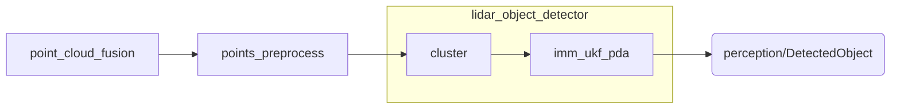

# Perception

为“无序”点云设计的点云处理工具包


## 组成

**Perception** 含如下子包

* perception，适配 `catkin` 编译时的 meta package

* perception_msgs，包含`ROS`中的消息定义

* point_cloud_fusion，将多个无序点云按照刚体变换关系（tf::Transform）合并为同一点云

* points_preprocess，按照一定的规则（几何）对输入的点云进行滤除

* lidar_object_detector，对点云进行聚类，并使用概率模型进行追踪

  




## 安装

```sh
mkdir -p perception_ws/src
cd perception_ws/src
git clone http://github.com/tanzby/Perception.git
cd ..
catkin build perception
```

