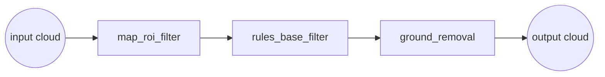
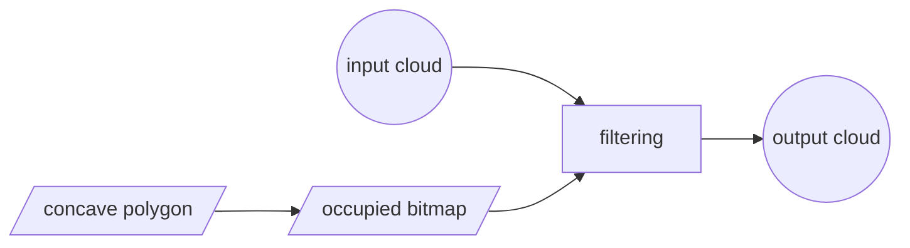

# points_preprocess

**参数**

关于***全局设定***

|         参数名          |  类别  |               说明                |
| :---------------------: | :----: | :-------------------------------: |
|       `/in_cloud`       | 字符串 |          输出点云话题名           |
|      `/out_cloud`       | 字符串 |       处理后输出点云话题名        |
|  `use_ground_removal`   | 布尔值 |         是否滤除地面点云          |
| `use_rules_base_filter` | 布尔值 |     是否按照简单规则滤除点云      |
|  `use_map_roi_filter`   | 布尔值 | 是否使用多边形滤除进行ROI区域滤除 |

关于***MapROIFilter***

|    参数名     |  类别  |                   说明                   |
| :-----------: | :----: | :--------------------------------------: |
|    `range`    | 浮点数 | 滤除区域范围，处于该区域外的点云直接滤除 |
| `extend_dist` | 浮点数 |         向外拓展多边形边缘的长度         |
|  `cell_size`  | 浮点数 |   浮点数  ROI滤除时单一离散化网格大小    |

关于***RulesBaseFilter***

使用8个参数描述一大一小两个矩形，只保留两个矩形中间的点，即将车体附近的点云滤除，将超过一定距离的点云滤除

**额外需求**

如需要使用map_roi_filter，用户必须从外部配置TF-tree，以保证可以从系统的TF-Tree中寻找到输入点云坐在坐标系（"/base_link"），与表示ROI的多边形所在坐标系（"/map"）之间的姿态变换